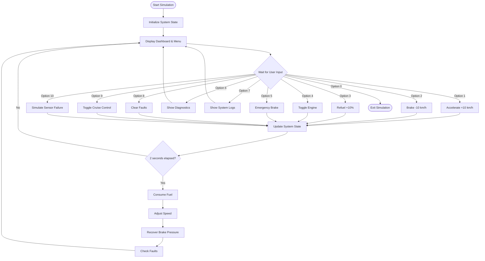
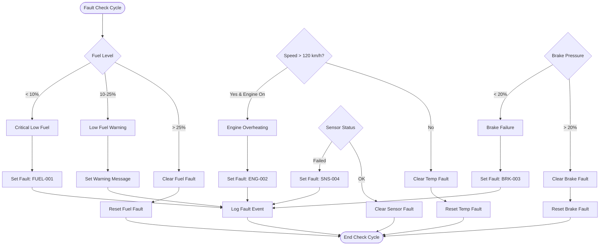
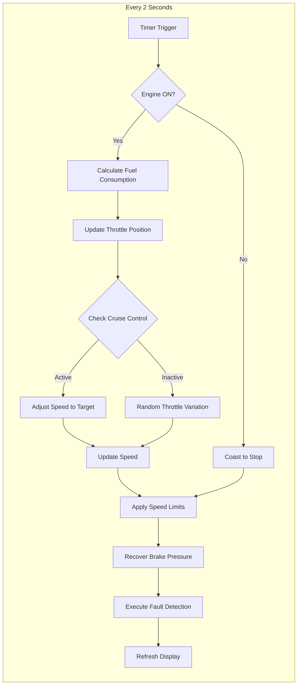
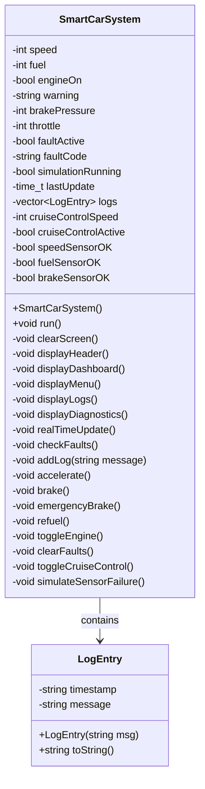
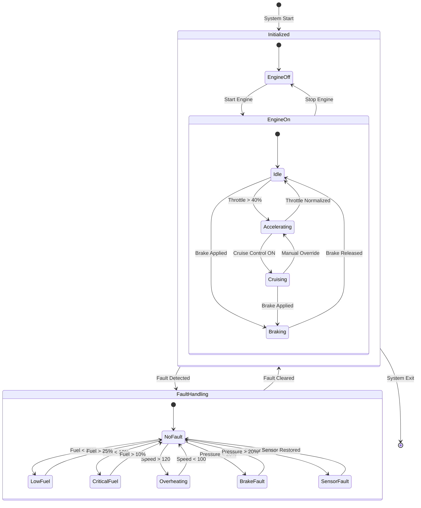
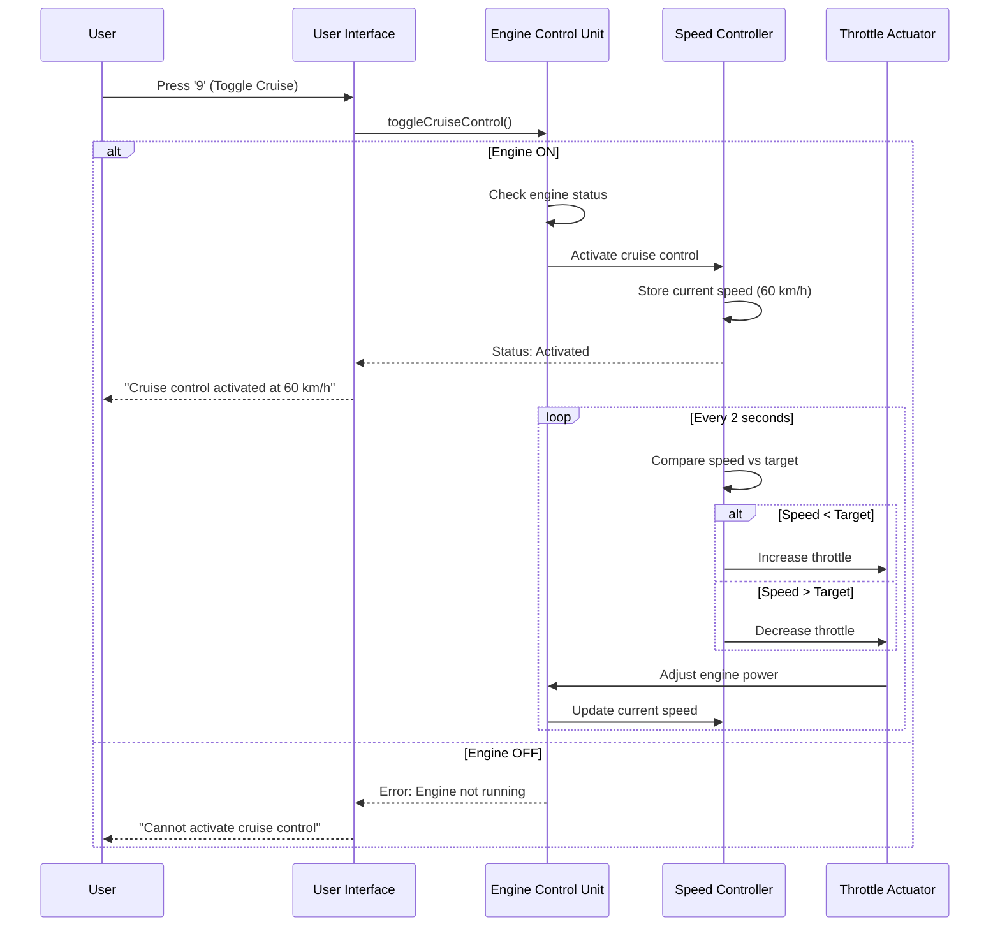

# 🚗 Smart Car Embedded System Simulation

[](https://isocpp.org/)
[](https://github.com/)
[](LICENSE)
[](https://github.com/)
[](https://github.com/)
[](https://github.com/)

> A comprehensive terminal-based embedded system simulation for a smart car with real-time monitoring, fault detection, and interactive controls.

## 📋 Table of Contents
- [Overview](#overview)
- [Features](#features)
- [System Architecture](#system-architecture)
- [Flow Diagrams](#flow-diagrams)
- [UML Diagrams](#uml-diagrams)
- [Installation](#installation)
- [Usage](#usage)
- [Controls](#controls)
- [Simulation Modules](#simulation-modules)
- [Technical Specifications](#technical-specifications)
- [Screenshots](#screenshots)
- [Contributing](#contributing)
- [License](#license)

## 🎯 Overview

The **Smart Car System Simulation** is a complete embedded system simulator that mimics the behavior of a modern car's electronic control unit (ECU). It provides real-time monitoring of critical vehicle parameters, interactive control capabilities, and intelligent fault detection mechanisms.

### Key Metrics
- **Language**: C++17
- **Lines of Code**: ~600
- **Modules**: 6 core modules
- **Interactive Commands**: 10+ controls
- **Fault Types**: 4 detection categories

## ✨ Features

### Core Features
- ✅ **Real-time Simulation Loop** - Automatic updates every 2 seconds
- ✅ **Engine Control System** - Start/stop with realistic behavior
- ✅ **Fuel Monitoring** - Dynamic consumption based on throttle and speed
- ✅ **Speed Management** - Real-time speed variations with limits (0-180 km/h)
- ✅ **Brake System** - Normal and emergency braking with pressure simulation
- ✅ **Intelligent Fault Detection** - Automatic fault identification and logging

### Advanced Features
- 🎯 **Cruise Control System** - Maintain set speed automatically
- 📊 **System Diagnostics** - Detailed component status and metrics
- 📝 **Event Logging** - Timestamped system events (50 log capacity)
- 🔧 **Sensor Simulation** - Speed, fuel, and brake sensor failures
- 🎨 **Color-coded UI** - Visual feedback for different states
- ⚠️ **Priority Warnings** - Low fuel, overheating, brake issues

## 🏗️ System Architecture

### High-Level Architecture

    
    A --> D
    B --> D
    C --> D
    D --> E
    D --> F
    E --> G
    E --> H
    E --> I
    E --> J
    F --> K
    F --> L
    G --> M
    H --> M
    I --> M
    J --> M
    K --> N
    L --> O
    M --> A
    N --> B
    O --> B

    
    UI --> MAIN
    TIM --> UPDATE
    UPDATE --> THROTTLE
    UPDATE --> BRAKE_ACT
    UPDATE --> FUEL_INJ
    SPEED_SEN --> MAIN
    FUEL_SEN --> MAIN
    BRAKE_SEN --> MAIN
    TEMP_SEN --> MAIN
```

## 🔄 Flow Diagrams

### Main Simulation Loop



### Fault Detection Flow



### Real-time Update Cycle



## 📊 UML Diagrams

### Class Diagram



### State Machine Diagram



### Sequence Diagram - Cruise Control Activation



## 🚀 Installation

### Prerequisites
- **C++ Compiler** (GCC 7+, Clang 5+, or MSVC 2019+)
- **CMake** 3.10+ (optional)
- **Terminal** with ANSI color support

### Linux / macOS

```bash
# Clone the repository
git clone https://github.com/yourusername/smart-car-simulation.git
cd smart-car-simulation

# Compile with g++
g++ -o smart_car smart_car_simulation.cpp -std=c++11 -pthread

# Run the simulation
./smart_car
```

### Windows (MinGW)

```bash
# Clone the repository
git clone https://github.com/yourusername/smart-car-simulation.git
cd smart-car-simulation

# Compile with MinGW
g++ -o smart_car.exe smart_car_simulation.cpp -std=c++11

# Run the simulation
smart_car.exe
```

### Windows (Visual Studio)

```bash
# Open Developer Command Prompt
cl /EHsc /std:c++17 smart_car_simulation.cpp
smart_car_simulation.exe
```

### Using CMake

```bash
mkdir build && cd build
cmake ..
make
./smart_car_simulation
```

## 🎮 Usage

### Quick Start
1. Launch the program from terminal
2. View real-time dashboard with current car status
3. Enter menu options (0-10) to control the vehicle
4. Watch real-time updates every 2 seconds

### Initial State
```
Speed: 60 km/h
Fuel: 45%
Engine: ON
Warning: Low Fuel
Brake Pressure: 100%
Throttle: 30%
```

## 🎛️ Controls

| Option | Action | Description |
|--------|--------|-------------|
| **1** | Accelerate | Increases speed by 10 km/h (max 180) |
| **2** | Brake | Decreases speed by 10 km/h, reduces brake pressure |
| **3** | Refuel | Adds 10% fuel (max 100%) |
| **4** | Toggle Engine | Starts or stops the engine |
| **5** | Emergency Brake | Immediately stops vehicle |
| **6** | Diagnostics | Shows detailed system status |
| **7** | View Logs | Displays system event history |
| **8** | Clear Faults | Resets active fault codes |
| **9** | Cruise Control | Toggles automatic speed maintenance |
| **10** | Sensor Failure | Simulates sensor malfunctions |
| **0** | Exit | Shuts down simulation |

## 🔧 Simulation Modules

### 1. Engine Control Unit (ECU)
- Start/stop engine with realistic behavior
- Throttle position management (0-100%)
- RPM calculation (Speed × 30)
- Automatic engine shutdown on fuel depletion

### 2. Fuel Management System
- Dynamic fuel consumption based on throttle
- Consumption formula: `(throttle / 10) + 1` per 2 seconds
- Range estimation: `fuel × 12 km`
- Low fuel warnings at 25% and 10%

### 3. Speed Control System
- Speed range: 0-180 km/h
- Realistic acceleration/deceleration
- Cruise control with set speed maintenance
- Speed sensor simulation with failure modes

### 4. Brake Control System
- Normal braking: -10 km/h, -15% pressure
- Emergency braking: Instant stop, 60% pressure drop
- Automatic pressure recovery (+5% per cycle)
- ABS simulation through pressure management

### 5. Fault Detection System
| Fault Code | Description | Trigger Condition |
|------------|-------------|-------------------|
| FUEL-001 | Critical low fuel | Fuel < 10% |
| ENG-002 | Engine overheating | Speed > 120 km/h |
| BRK-003 | Brake pressure low | Pressure < 20% |
| SNS-004 | Sensor failure | Manual trigger |

### 6. Sensor Management
- **Speed Sensor**: Monitors vehicle velocity
- **Fuel Sensor**: Measures fuel level
- **Brake Pressure Sensor**: Monitors brake system health
- **Temperature Sensor**: Engine temperature monitoring

## 📊 Technical Specifications

### System Parameters
```
Update Interval:     2 seconds
Speed Range:         0-180 km/h
Fuel Capacity:       0-100%
Brake Pressure:      0-100%
Throttle Range:      0-100%
Log Capacity:        50 events
RPM Formula:         Speed × 30
Fuel Consumption:    (Throttle/10) + 1 per 2s
Range Formula:       Fuel × 12 km
```

### Performance Metrics
```
CPU Usage:          < 1%
Memory Usage:       ~2-5 MB
Response Time:      < 100ms
Display Refresh:    Real-time
```

## 📸 Screenshots

### Main Dashboard
```
════════════════════════════════════════════════════════════════
           SMART CAR EMBEDDED SYSTEM SIMULATION v3.0
════════════════════════════════════════════════════════════════

━━━━━━━━━━━━━━━━━━━━━ MAIN DASHBOARD ━━━━━━━━━━━━━━━━━━━━━

Speed:       60 km/h
Fuel:        45%
Engine:      ON
Warning:     ⚠ Low Fuel
Fault:       ✓ No faults
Brake Pressure: 100%
Throttle:    30%

━━━━━━━━━━━━━━━━━━━━━━━━━━━━━━━━━━━━━━━━━━━━━━━━━━━━━━━━
```

### Color Coding Legend
- 🟢 **Green**: Normal/Good status
- 🟡 **Yellow**: Warning/Caution
- 🔴 **Red**: Critical/Danger
- 🔵 **Blue**: Information/Menu
- 🟠 **Cyan**: System messages

## 🤝 Contributing

Contributions are welcome! Here's how you can help:

1. **Fork** the repository
2. **Create** a feature branch (`git checkout -b feature/AmazingFeature`)
3. **Commit** changes (`git commit -m 'Add AmazingFeature'`)
4. **Push** to branch (`git push origin feature/AmazingFeature`)
5. **Open** a Pull Request

### Development Ideas
- [ ] Add gearbox simulation
- [ ] Implement ABS system
- [ ] Add traction control
- [ ] Create GUI version
- [ ] Add network communication
- [ ] Implement data logging to file
- [ ] Add more fault scenarios
- [ ] Create configuration file support

## 📝 License

This project is licensed under the MIT License - see the [LICENSE](LICENSE) file for details.

```
MIT License

Copyright (c) 2024 Smart Car Simulation

Permission is hereby granted, free of charge, to any person obtaining a copy
of this software and associated documentation files...
```

## 🙏 Acknowledgments

- Inspired by modern automotive ECU systems
- Built with C++17 standards
- Terminal colors using ANSI escape codes
- Real-time simulation design patterns


## 📈 Version History

- **v3.0** (Current)
  - Added cruise control system
  - Enhanced fault detection
  - Added sensor simulation
  - Improved UI with colors
  - Added system diagnostics

- **v2.0**
  - Added real-time simulation
  - Implemented logging system
  - Added emergency brake

- **v1.0**
  - Initial release
  - Basic controls
  - Core modules

---

<div align="center">
Made with ❤️ for embedded systems enthusiasts
</div>
```


